# Architecture

This architecture reflects the repository state verified on 2026-05-03.

## System Diagram

```mermaid
flowchart TD
  subgraph Research["Research and Planning"]
    Synth["plan/synthesis.md"]
    Roadmap["plan/roadmap.md"]
    Model["research/codex2_data_model.md"]
    DDL["research/codex4_ddl_v01-v03.sql"]
    Taxonomy["research/codex7_function_taxonomy.json"]
    WDQueries["research/codex5_queries/*.sparql"]
  end

  subgraph Sources["Public Sources and Manual Cases"]
    ROR["ROR API"]
    Wikidata["Wikidata SPARQL"]
    Manual["Representative case annotations"]
  end

  subgraph ETL["ETL Scripts"]
    LoadFunction["etl/01_load_function_types.py"]
    SeedForms["etl/02_seed_organization_forms.py"]
    WikidataETL["etl/03_wikidata_pilot.py / etl/05_wikidata_typed.py"]
    RORETL["etl/06_ror_pilot.py"]
    CaseETL["etl/04_representative_cases.py / etl/08_phase3_chain_cases.py"]
    AnalysisETL["etl/09_generate_genealogy_svg.py / etl/10_network_statistics.py"]
  end

  subgraph Storage["Storage"]
    SQLiteSchema["sql/schema_sqlite_v01.sql"]
    TemporalFacetSchema["sql/schema_sqlite_v05_temporal_facet.sql"]
    DB["data/og.db"]
    Postgres["PostgreSQL target"]
  end

  subgraph CoreTables["Core Tables"]
    Source["source"]
    Claim["claim"]
    Organization["organization"]
    Form["organization_form / assignment"]
    FunctionType["function_type"]
    Activity["activity"]
    FunctionRecord["function_record"]
    Impact["impact_record"]
    Event["event / event_organization"]
    Relation["relation / event_relation"]
    Dormancy["dormancy_record"]
    Facet["organization_temporal_facet"]
  end

  subgraph Outputs["Analysis Outputs"]
    NetworkStats["data/network_stats.json"]
    GenealogySVG["data/genealogy_network.svg"]
    FunctionCoverage["data/function_coverage.md"]
    QualityReport["data/data_quality_report.md"]
  end

  Synth --> Roadmap
  Model --> DDL
  Taxonomy --> LoadFunction
  WDQueries --> WikidataETL
  DDL --> SQLiteSchema
  SQLiteSchema --> DB
  TemporalFacetSchema --> DB
  DB -.migration target.-> Postgres

  ROR --> RORETL
  Wikidata --> WikidataETL
  Manual --> CaseETL
  LoadFunction --> DB
  SeedForms --> DB
  RORETL --> DB
  WikidataETL --> DB
  CaseETL --> DB

  DB --> Source
  DB --> Claim
  DB --> Organization
  DB --> Form
  DB --> FunctionType
  DB --> Activity
  DB --> FunctionRecord
  DB --> Impact
  DB --> Event
  DB --> Relation
  DB --> Dormancy
  DB --> Facet

  DB --> AnalysisETL
  AnalysisETL --> NetworkStats
  AnalysisETL --> GenealogySVG
  DB --> FunctionCoverage
  DB --> QualityReport
```

## Data Flow

1. Research artifacts define the model. `plan/synthesis.md`, `plan/roadmap.md`, `research/codex2_data_model.md`, the codex4 DDL files, codex5 SPARQL queries, and codex7 taxonomy provide the project decisions and schema inputs.

2. Schema is developed locally in SQLite. `sql/schema_sqlite_v01.sql` ports the PostgreSQL v0.1-v0.3 design into the sandbox, and `sql/schema_sqlite_v05_temporal_facet.sql` adds the v0.5 temporal facet table.

3. ETL scripts populate `data/og.db`. The pipeline loads the 25 master function types, seeds organization forms, imports ROR academic institutions, imports typed Wikidata seed records, and adds fully annotated representative cases.

4. All substantive descriptions pass through `source` and `claim`. The `claim.value_kind` five-state design preserves `unknown`, `absent`, and `inapplicable` as distinct states.

5. The core model stores organizations as claim-backed nodes, forms, activities, function records, impact records, events, relations, dormancy records, and temporal facets. Legal corporation is one form among others, not the schema default.

6. Analysis scripts read from SQLite to produce network statistics and visualizations such as `data/network_stats.json` and `data/genealogy_network.svg`. PostgreSQL remains the production target for pgvector and production-grade indexing.

## Verified Repository References

- `plan/synthesis.md`
- `plan/roadmap.md`
- `plan/phase1_complete.md`
- `plan/phase3_complete.md`
- `research/codex2_data_model.md`
- `research/codex4_ddl_v01.sql`
- `research/codex4_ddl_v02.sql`
- `research/codex4_ddl_v03.sql`
- `research/codex5_wikidata_sparql.md`
- `research/codex7_function_taxonomy.json`
- `research/codex7_extension_examples.json`
- `sql/schema_sqlite_v01.sql`
- `sql/schema_sqlite_v05_temporal_facet.sql`
- `etl/01_load_function_types.py` through `etl/10_network_statistics.py`
